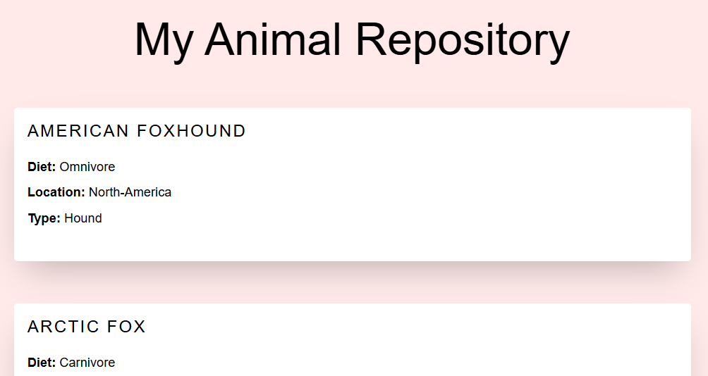

# Animal Repository
A webpage which tracks and displays information about various mammalian species.

|               |                                    |
|---------------|------------------------------------|
| Author        | Natasha Libera                     |
| Course        | MSIT Software Entwicklung Jan 2026 |
| Codio Project | Zootopia                           |

## Demo Page
The generated pages follow this design:

## Available Scripts
### Animal Facts Generator
Prints out the animal data to the console

    python animals_card_generator.py

### Animal Webpage Generator
Generates an HTML page that can be run in the
browser to see a formatted list of fact cards.

    python animals_page_generator.py

Output: `animals.html`

### Config Editor
A tool which allows the user to choose the fields displayed and set filters for data used in output generation.

    python config_editor.py

Output: `config.json`